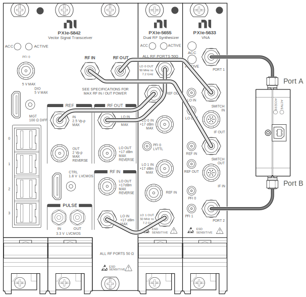

# Sample: Using hardware and software together

In this topic, I walk the reader through using InstrumentStudio, a software application that mimics the visual front panel present on many types of test instruments, to perform vector network analyzer measurements with a measurement device, the PXIe-5842 with S-parameters. The customer base should already be familiar with what a vector network analyzer (VNA) does, so the focus of the topic is on navigating an application they may not be familiar with rather than explaining VNA measurement fundamentals.

---

## Performing Interactive VNA Measurements in InstrumentStudio

You can use InstrumentStudio to access the VNA functionality of the PXIe-5842 with S-parameters through an interactive soft front panel.

This process assumes you have already performed initial hardware configuration in Hardware Configuration Utility or MAX.

Refer to InstrumentStudio documentation for information on the layout of InstrumentStudio.

Complete the following steps to interactively control your PXIe-5842 with S-parameters in InstrumentStudio:

1. Open a Network Analyzer panel in InstrumentStudio.
   - From InstrumentStudio: Click  » **Network Analyzer** or create a layout automatically based on the equipment in your system.
   - From Hardware Configuration Utility: Select the PXIe-5633 module within the overall PXIe-5842 with S-parameters and, within the instrument configuration panel on the right side, click **Measurement panel.**
1. Configure reference clock settings.

   **PXI_Clk** is the valid source for PXIe-5842 with S-parameters VNA functionality.
1. **Optional:** If you want to use de-embedding to remove the effect of fixtures from your measurements, in the instrument configuration panel, click   » **Instrument** and choose the relevant settings.

   **Note:** To apply de-embedding, you must have .s2p files available for each port you want to de-embed.
1. Define the frequency sweep settings.

| Sweep Method | Description |
| ------------ | ----------- |
| Start/Stop | Define a low start frequency and a high stop frequency for the sweep, as well as the total number of frequency points to include in the sweep. |
| Frequency List | List that specifies each individual frequency to include in the sweep. Specify the frequencies to include. |

5. **Optional:** Configure advanced sweep settings with   » **Sweep**.
   1. Choose the IF bandwidth to allocation to the measurement.

      **Note:** Only discrete bandwidth values are supported. If you choose an unsupported value, the bandwidth is coerced up to the next supported value.
   1.  Configure power and attenuation settings.
   1. Configure delay and dwell.
   1. Choose whether to turn the VNA source off during measurements.
1. **Optional:** Enable per-point measurement averaging and choose the number of measurements to average with  » **Averaging**.
1. Apply or perform measurement calibration.
   - Apply an existing correction from a file:
     1. Check **correction enabled**.
     1. Click **Load Calset from File** and navigate to the calset file to apply.
   - Perform measurement calibration:
     1. Click   » **Calibration**.
     1. Select options for the measurement calibration:
        - 1-port calibration: For **Ports**, select **port1** or **port2**; for **Method**, select **SOL**
        - 2-port calibration: for **Ports**, select **port1, port2**; for **Method**, select **SOLT**
     1. Connect the CAL-5501 to the PXIe-5633 module:

        

        Connection shown:
        - CAL-5501 PORT A to PXIe-5633 PORT 1
        - CAL-5501 PORT B to PXIe-5633 Port 2

       **Note:** Measurement calibration calculates corrections at the ports of the CAL-5501 module. For best results, connect the CAL-5501 in place of your DUT, leaving the rest of your physical setup exactly as it will be used during DUT measurements.

     4. Click **Calibrate**.
     5. To save the calibration data for later use, select **Save Calset to File**.
1. **Optional:** To apply correction to only a subset of the ports for which the calset contains correction data, click  » **Correction** and adjust the options.

   **Note:** If the calset originates from a two-port measurement calibration but you are measuring on only one port, you still need to perform both sweeps to apply the corrections for the single port.

1. Define the measurements to perform, S-parameters or incident and reflected waves, with the **ADD / REMOVE** button in the **Measurements** section of the instrument configuration panel.
1. Configure measurement-specific settings in the instrument configuration panel or with  » **S-parameters** or  » **Waves**.
1. Connect your DUT, if it is not connected already.
   - 1-port, 1-device measurement: Connect the port of your device to a port of the PXIe-5633 module, and terminate the other PXIe-5633 port with a 50 Ω terminator
   - 2-port measurement: Connect each port of your device to a port of the PXIe-5633 module
1. Run the measurement by clicking **RUN** to measure continuously or **SINGLE** to capture a single measurement.

   The measurement you have configured displays in the measurement graph.
